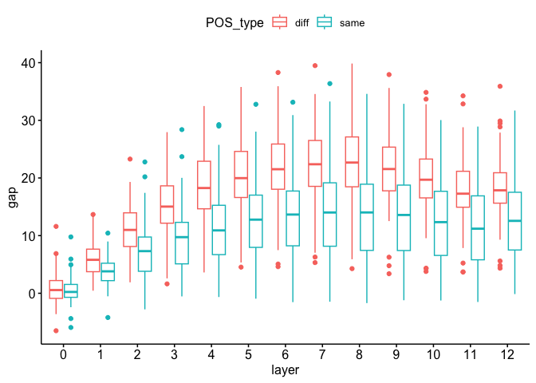

analysis_homonymy
================
Matthew King-Hang Ma
2025-02-05

``` r
# For general purpose and plotting
library(Cairo)
library(tidyverse)
```

    ## ── Attaching core tidyverse packages ──────────────────────── tidyverse 2.0.0 ──
    ## ✔ dplyr     1.1.3     ✔ readr     2.1.4
    ## ✔ forcats   1.0.0     ✔ stringr   1.5.0
    ## ✔ ggplot2   3.4.4     ✔ tibble    3.2.1
    ## ✔ lubridate 1.9.3     ✔ tidyr     1.3.0
    ## ✔ purrr     1.0.2     
    ## ── Conflicts ────────────────────────────────────────── tidyverse_conflicts() ──
    ## ✖ dplyr::filter() masks stats::filter()
    ## ✖ dplyr::lag()    masks stats::lag()
    ## ℹ Use the conflicted package (<http://conflicted.r-lib.org/>) to force all conflicts to become errors

``` r
library(arrow)
```

    ## 
    ## Attaching package: 'arrow'
    ## 
    ## The following object is masked from 'package:lubridate':
    ## 
    ##     duration
    ## 
    ## The following object is masked from 'package:utils':
    ## 
    ##     timestamp

``` r
library(ggpubr)
library(ggsci)
library(patchwork)

# For statistical analysis
# library(rstatix)
# library(emmeans)
# library(ez)
# library(xtable)
# library(lme4)
# library(lmerTest)
# library(ggstatsplot)
# library(MuMIn)

# Define your 
wd = ("~/Documents/exploring-homonym-representations-in-llm")
```

# Data preprocessing

This section prepares two dataframe `df_sim_byword` and `df_gap` from
the file `df_raw_byword.feather`, which is the dataframe generated by
Python scripts.

Columns: - `cos_sim`: cosine similarity - `angle_diff`: angular
differences (computed as arccos(cos_sim)) - `angle_sim`: 90 -
`angle_diff`, has the same interpretation as cosine similarity

Suffix: `_b`: baseline `_adj`: adjusted

``` r
df_sim_byword = arrow::read_feather(file.path(wd, "statistics//data//df_raw_byword.feather"))
df_sim_byword$word = factor(df_sim_byword$word)
df_sim_byword$model = factor(df_sim_byword$model)
df_sim_byword$lang = factor(df_sim_byword$lang)
df_sim_byword$sense = factor(df_sim_byword$sense)
df_sim_byword$SamePOS = factor(df_sim_byword$SamePOS)
df_sim_byword$sense_type = factor(df_sim_byword$sense_type)

df_sim_byword = df_sim_byword %>% rename(POS_type = SamePOS,
                                         angle_diff_b = angle_b,
                                         angle_diff = angle)

df_sim_byword$POS_type = factor(df_sim_byword$POS_type, levels=c(0, 1), labels=c("diff", "same"))

df_sim_byword = df_sim_byword %>% select(word, model, layer, layer_rel, lang, POS_type, sense_type, sense, cos_sim, cos_sim_b, angle_diff, angle_diff_b)

df_sim_byword = df_sim_byword %>% mutate(angle_sim = 90 - df_sim_byword$angle_diff)
df_sim_byword = df_sim_byword %>% mutate(angle_sim_b = 90 - df_sim_byword$angle_diff_b)
df_sim_byword = df_sim_byword %>% mutate(angle_sim_adj = angle_sim - angle_sim_b)
df_sim_byword %>% head()
```

    ## # A tibble: 6 × 15
    ##   word  model  layer layer_rel lang  POS_type sense_type sense cos_sim cos_sim_b
    ##   <fct> <fct>  <dbl>     <dbl> <fct> <fct>    <fct>      <fct>   <dbl>     <dbl>
    ## 1 angle Llama…     0    0      en    diff     diff       0       1         0.107
    ## 2 angle Llama…     0    0      en    diff     same       1       1         0.110
    ## 3 angle Llama…     0    0      en    diff     same       2       1         0.110
    ## 4 angle Llama…     1    0.0312 en    diff     diff       0       0.861     0.220
    ## 5 angle Llama…     1    0.0312 en    diff     same       1       0.927     0.225
    ## 6 angle Llama…     1    0.0312 en    diff     same       2       0.948     0.223
    ## # ℹ 5 more variables: angle_diff <dbl>, angle_diff_b <dbl>, angle_sim <dbl>,
    ## #   angle_sim_b <dbl>, angle_sim_adj <dbl>

Creating the dataframe `df_gap` storing the gap measurement.

`gap`: same-sense angular similarity - cross-sense angular similarity

``` r
df_gap = df_sim_byword %>% select(-cos_sim, -cos_sim_b, -angle_diff_b, -angle_diff, -angle_sim, -angle_sim_b) %>% pivot_wider(names_from=c("sense_type", "sense"), values_from = "angle_sim_adj") %>% mutate("1" = same_1 - diff_0, "2" = same_2 - diff_0) %>% select(-diff_0, -same_1, -same_2) %>% pivot_longer(c("1", "2"), names_to = "sense", values_to = "gap")

df_gap$sense= factor(df_gap$sense)
df_gap %>% head()
```

    ## # A tibble: 6 × 8
    ##   word  model        layer layer_rel lang  POS_type sense    gap
    ##   <fct> <fct>        <dbl>     <dbl> <fct> <fct>    <fct>  <dbl>
    ## 1 angle Llama-3.1-8B     0    0      en    diff     1     -0.144
    ## 2 angle Llama-3.1-8B     0    0      en    diff     2     -0.150
    ## 3 angle Llama-3.1-8B     1    0.0312 en    diff     1      8.99 
    ## 4 angle Llama-3.1-8B     1    0.0312 en    diff     2     12.2  
    ## 5 angle Llama-3.1-8B     2    0.0625 en    diff     1      7.24 
    ## 6 angle Llama-3.1-8B     2    0.0625 en    diff     2     18.0

# Example codes in plotting figures

Angular similarity gaps in English homographs by part of speech
(BERT-base-uncased)

``` r
ggboxplot(df_gap %>% filter(model=="bert-base-uncased", lang=="en"), x="layer", y="gap", color=c("POS_type"))
```

<!-- -->
